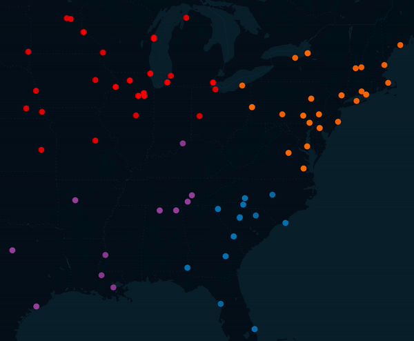
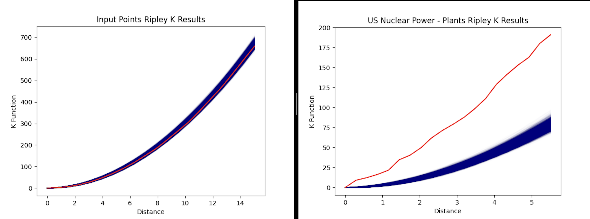

# clustering_algorithms
Collection of clustering algorithms for spatial analysis.

## SETUP ##
Let's set up our environment first. I prefer to use pyenv, but you can use whatever environment manager you'd like.

    https://realpython.com/intro-to-pyenv/

Install Python

    pyenv install python 3.11.6

Create a new pyenv environment

    pyenv virtualenv 3.11.6 clustering_algs

Activate the new environment

    pyenv activate clustering_algs

Make sure pip is on the most current version

    pip install -U pip

Install the required modules

    pip install -r requirements.txt

## Example Usage ##
data_path

    "input_file/test_points.shp"

DBSCAN Clustering
      
    clustered_data = dbscan_cluster(data_path, 'dbscan_clusters')

K-Means Clustering
      
    kmeans_cluster(data_path, 5, "kmeans_clusters")

K-Menoids PAM Clustering
      
    df_clustered = run_kmedoids_pam_clustering(data_path, 5, "kmenoids_clusters")

Evalute Clusters (K-Means)
      
    print(evaluate_clusters(data_path, 5))

## Example Output ##

Here are a few example visualizations of the output from using the different algorithms against a dataset containing US Nuclear Power Plants. 

K-Means with 5 clusters (means in white):

K-Menoids with 5 clusters (menoids in white): 

Rilpey's K against the Nuclear Powerpoint Dataset and the synthetically generated, evenly distributed data:

